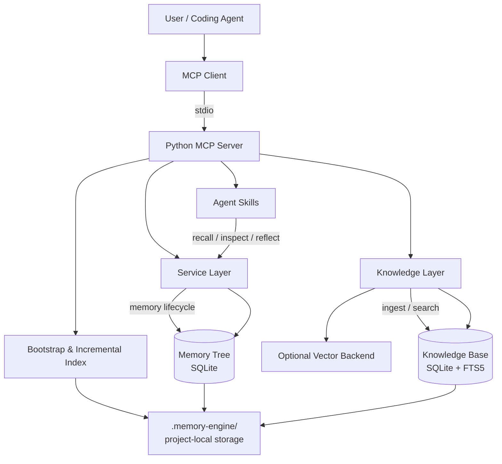
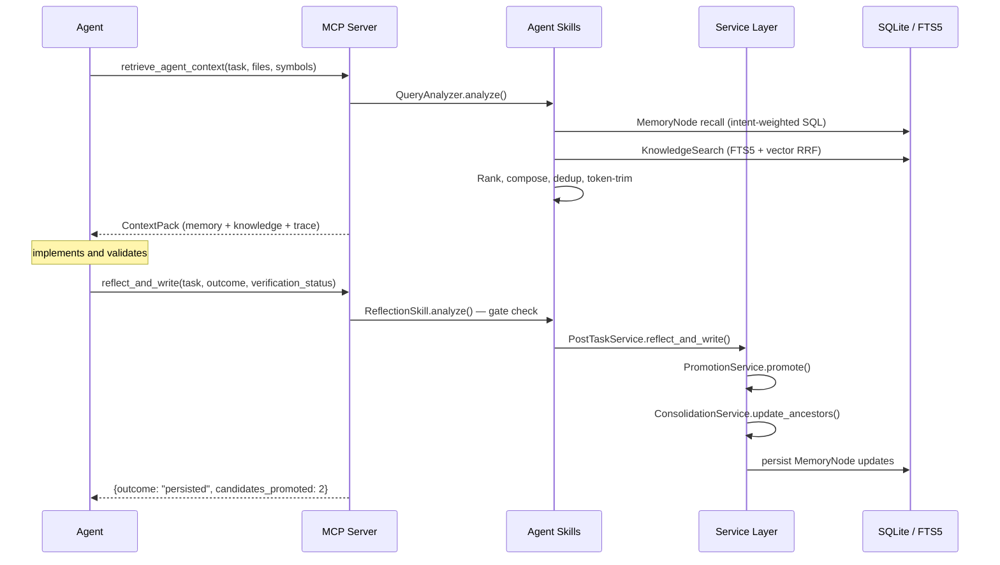

<p align="center">
  
</p>

<p align="center">
  <strong>Local-first persistent memory and project knowledge runtime for coding agents.</strong>
</p>

<p align="center">
  <a href="https://github.com/uudam42/agent-memory-engine/actions/workflows/ci.yml">
  </a>
  <a href="https://github.com/uudam42/agent-memory-engine/blob/main/LICENSE">
    

 
</p>

<p align="center">
  <a href="README.md">English</a> | <a href="README.zh-CN.md">中文</a>
</p>

---

# Agent Memory Engine

**A local-first MCP runtime that gives coding agents persistent, evidence-backed project memory and grounded project knowledge across sessions.**

---

## Why it exists

Coding agents face a fundamental problem: every session starts cold.

- They forget project context between sessions.
- They repeatedly scan repositories to re-learn what modules do.
- They lose debugging lessons and historical decisions.
- Flat RAG cannot distinguish stable constraints, past incidents, architecture decisions, and raw code evidence.
- Even large context windows still require intelligent prioritization and token budgeting.

Memory Engine solves this by maintaining a structured, evidence-backed memory tree alongside an indexed project knowledge base — both local, both automatic, no infrastructure required.

---

## Core capabilities

| Capability | Details |
|---|---|
| **Persistent memory tree** | MemoryNode hierarchy: constraints, architecture, modules, decisions, incidents, procedures |
| **Evidence-backed memory** | Each node links to source Evidence entries (test output, code references, review notes) |
| **Candidate staging** | Reflection generates MemoryCandidates before promoting to the live tree |
| **Confidence-aware promotion** | create / update / merge / supersede / discard / needs_review |
| **Conflict detection** | High-risk areas (auth, schema, state-machine, retry) flagged for review |
| **Ancestor consolidation** | Parent node summaries auto-updated after each promotion |
| **Agent-native recall** | Intent-aware retrieval before coding tasks — no manual queries |
| **Progressive inspection** | Drill down into any memory node, its children, and linked evidence |
| **Automatic post-task reflection** | Agent reports outcome → system decides whether and how to retain knowledge |
| **Knowledge ingestion** | Markdown, code, ADR, test reports, runtime logs, git diffs |
| **Local FTS5 search** | SQLite FTS5 with porter tokenizer; no external search engine |
| **Optional vector retrieval** | InMemoryVectorIndex (ephemeral) or future persistent backends |
| **Lexical structured fallback** | Full retrieval without vector backend or Docker |
| **Unified ContextPack** | Memory + knowledge merged, deduplicated, token-budgeted |
| **Retrieval traceability** | Per-signal score breakdown in every response |
| **Local-first privacy** | All data stays inside `.memory-engine/`; no telemetry, no cloud calls |
| **Python MCP server** | stdio transport; no TypeScript, no Docker, no external daemon |
| **Zero-touch bootstrap** | Auto-initializes on first MCP connection |
| **Incremental indexing** | JSON manifest; only changed files re-indexed on subsequent runs |
| **Git-aware synchronization** | Detects branch, HEAD commit, staged/modified files via safe read-only Git commands |
| **Branch-aware retrieval** | Prefers memory from the current branch; falls back to mainline then global |
| **Branch-scoped memory writes** | New memories stamped with branch name and scope; mainline promotion is explicit |
| **Multi-granularity memory** | Four retrieval layers (proposition → paragraph → chunk → module summary) created at write-time; selected at query-time by intent |
| **Deterministic proposition extraction** | Atomic facts extracted from docstrings, security comments, raise statements, markdown bullets — no LLM required |
| **Intent-aware granularity routing** | `bug_fix` retrieves constraint/risk propositions; `architecture_review` retrieves module summaries |
| **Query-time context assembly** | Proposition hits optionally expand to parent paragraphs; architecture queries attach module summaries |
| **Memory retention & compaction** | Candidate expiry, stale/superseded archival, multi-source compaction with full lineage — no physical deletion |
| **Protected memory types** | `constraint`, `security_rule`, `architecture`, `decision` excluded from all auto-archive and auto-compaction |
| **Agent memory policy** | Canonical `AGENT_MEMORY_POLICY.md` auto-installed to `CLAUDE.md` / `.cursor/rules/` on first bootstrap; CLI available for manual control |
| **Project context seeding** | `seed_project_context` MCP tool + `memory seed` CLI wizard — write initial constraints, decisions, and project overview on day 1, eliminating the cold-start problem |
| **Windows installer** | PowerShell installer (`scripts/install.ps1`) for Windows-native setup without Docker, WSL, or cloud services |

---

## Quick Start

**macOS / Linux:**
```bash
git clone https://github.com/uudam42/agent-memory-engine.git
cd agent-memory-engine
bash scripts/install.sh
```

**Windows (PowerShell):**
```powershell
git clone https://github.com/uudam42/agent-memory-engine.git
cd agent-memory-engine
.\scripts\install.ps1
```

The installer checks Git and Python 3.11+, installs `uv` when needed, resolves
dependencies, runs a health check, and prints a ready-to-copy MCP configuration
for Cursor or Claude Code. No Docker, WSL, or cloud services required.

### Default Deployment Model

Agent Memory Engine runs locally as a **stdio MCP server**. The default setup
uses Python, `uv`, and local SQLite/FTS5 storage. Docker, cloud databases, and
external embedding services are not required for the standard local workflow.

### MCP Stdio Mode *(recommended)*

Runs locally through the MCP client using `uv run`. Supported by Cursor,
Claude Code, and any client that implements the MCP stdio transport.

**Option A — explicit project root (Cursor, most clients):**

```json
{
  "mcpServers": {
    "memory-engine": {
      "command": "uv",
      "args": [
        "run",
        "--directory",
        "/absolute/path/to/agent-memory-engine",
        "memory-engine-mcp",
        "--project-root",
        "/absolute/path/to/your-project"
      ]
    }
  }
}
```

**Option B — project root via environment variable (Claude Code):**

```json
{
  "mcpServers": {
    "memory-engine": {
      "command": "uv",
      "args": [
        "run",
        "--directory",
        "/absolute/path/to/agent-memory-engine",
        "memory-engine-mcp"
      ],
      "env": {
        "MEMORY_ENGINE_PROJECT_ROOT": "/absolute/path/to/your-project"
      }
    }
  }
}
```

> **Note:** Replace all `/absolute/path/to/...` with real paths on your machine.
> Config file location and workspace-variable support differ by client:
> - **Cursor:** `.cursor/mcp.json` or global Cursor MCP settings
> - **Claude Code:** `~/.claude.json` or project-level config
> - Run `bash scripts/install.sh` to get a pre-filled config block with your actual paths.

### FastAPI / HTTP Mode *(optional)*

A FastAPI application (`memory_engine/main.py`) is included for direct API
experimentation, demos, or containerized environments. It is **not required**
for the standard MCP workflow.

```bash
uvicorn memory_engine.main:app --reload
# API docs at http://localhost:8000/docs
```

### Manual setup *(advanced)*

```bash
# Install uv once
curl -LsSf https://astral.sh/uv/install.sh | sh

# Install dependencies
uv sync

# Run MCP server directly
uv run memory-engine-mcp --project-root /path/to/project --log-level DEBUG
```

### Open your target project and start coding

That's it. Memory Engine starts automatically on the first MCP connection and
handles bootstrap, indexing, and memory management from there.

---

## What happens automatically

```
User opens project
     │
     ▼
MCP client starts memory-engine-mcp via stdio
     │
     ▼
Project root resolved (.git / pyproject.toml / package.json marker)
     │
     ▼
.memory-engine/ created (if first use)
     │
     ▼
README, ADRs, architecture docs, constraints indexed first
     │
     ▼
Broader source files indexed incrementally in background
     │
     ▼
Agent starts non-trivial coding task
     │
     ▼  [automatic]
retrieve_agent_context called
     │   → relevant constraints, incidents, decisions, procedures, source refs
     │
     ▼
Agent implements and validates
     │
     ▼  [automatic, on success]
reflect_and_write called
     │   → system evaluates retention gates
     │   → creates MemoryCandidates if worthy
     │   → promotes to memory tree
     │   → consolidates ancestor summaries
     │
     ▼
memory_status shows updated counts
```

---

## Architecture



---

## Agent calling chain



---

## Memory lifecycle

```
Task result
    │
    ▼
ReflectionSkill.analyze()
    │  gates: outcome ≠ failed/reverted, verification_status, confidence ≥ threshold,
    │         summary word count, known-trivial patterns
    │
    ├─ skip → return {skip_reason}
    │
    └─ pass ▼
    │
MemoryCandidate generation
    ├─ constraint     (importance 0.92)
    ├─ procedure      (importance 0.72)
    ├─ incident/debug (importance 0.85)
    ├─ module         (importance 0.62)
    └─ decision       (importance 0.82)
    │
    ▼
PromotionService.promote()
    ├─ create     — new node
    ├─ update     — same title, content refreshed
    ├─ merge      — near-duplicate (Jaccard ≥ 0.80)
    ├─ supersede  — existing node confirmed wrong
    ├─ discard    — low value / already known
    └─ needs_review — conflicts with high-confidence existing node
    │
    ▼
ConsolidationService.update_ancestors()
    │  parent.summary = concat(children.summaries)
    ▼
cache invalidated + memory_revision bumped
```

### Node statuses

| Status | Meaning | Default retrieval |
|---|---|---|
| `candidate` | Staged, pending promotion decision | Excluded |
| `active` | Live, returned in recall | Included |
| `stale` | Outdated; preserved for history | Penalized |
| `superseded` | Replaced by newer node | Excluded |
| `needs_review` | Flagged conflict; human review recommended | Excluded |
| `archived` | Historical / audit-only (Phase 11) | Excluded |
| `compacted` | Synthesis of source memories (Phase 11) | Included with lineage |
| `expired` | Candidate never promoted past window (Phase 11) | Excluded |

### Phase 11: Memory Retention

Memory does not grow indefinitely. The `MemoryRetentionService` runs lifecycle transitions:

```bash
# Diagnose
memory retention status <project>
memory retention report <project>

# Apply (dry-run by default)
memory retention run <project>
memory retention run <project> --no-dry-run

# Restore an archived memory
memory retention restore <project> <memory-id>
```

**Protected types** (`constraint`, `security_rule`, `architecture`, `decision`) are
never auto-archived or auto-compacted.

See [`docs/memory_retention_compaction.md`](docs/memory_retention_compaction.md).

---

## Knowledge lifecycle

```
Documents / code / ADRs / tests / logs / diffs
    │
    ▼
redact()  ← 8 patterns: API keys, tokens, passwords, private keys,
           │             connection strings, JWTs, AWS keys, Slack tokens
    ▼
SHA-256 content hash → dedup check
    │
    ▼
Source-type chunker
    ├─ Markdown    → heading-based sections (≤1200 tokens)
    ├─ Code        → class/function blocks   (≤1000 tokens)
    ├─ Test report → result windows
    ├─ Log         → sliding windows         (≤600 tokens)
    └─ Diff/Patch  → hunk-based chunks
    │
    ▼
KnowledgeDocument + KnowledgeChunk (SQLite)
    │
    ├─ FTS5 insert    (lexical — always available)
    └─ Vector upsert  (optional — InMemoryVectorIndex or Qdrant)
    │
    ▼
hybrid retrieval → RRF fusion → source-quality ranking
    │
    ▼
UnifiedContextPack (40% of token budget)

─── Phase 10: multi-granularity write path (runs in parallel) ───────────────

same raw content
    │
    ├─ paragraph_segmenter  → KnowledgeParagraphORM  → knowledge_paragraphs_fts
    ├─ proposition_extractor → KnowledgePropositionORM → knowledge_propositions_fts
    └─ summarizer           → KnowledgeChunkSummaryORM → knowledge_summaries_fts
    │
    ▼
multigranular retrieval (25% of knowledge budget)
    │
    ▼
UnifiedContextPack.multigranular_chunks (independent of knowledge_chunks budget)
```

---

## Directory structure

```
memory_engine/
├── main.py                  ← FastAPI app (dev / direct API use)
├── cli.py                   ← Debug CLI
├── config.py                ← Pydantic Settings
│
├── agent/                   ← Stage 8 namespace (re-exports)
│   ├── skills/              → memory_engine.skills
│   ├── policies/            → reflection gate constants
│   └── contracts/           → agent I/O domain models
│
├── skills/                  ← agent-facing behaviors (recall, inspect, reflect)
├── services/                ← domain orchestration (promotion, consolidation)
├── knowledge/               ← ingestion, chunking, FTS5, vector, search, fusion, cache
│                               proposition_extractor, paragraph_segmenter, summarizer,
│                               granularity_router, multigranular_search  (Phase 10)
├── repositories/            ← persistence abstraction (memory_node, candidate, evidence)
├── models/                  ← Pydantic domain + SQLAlchemy ORM
│
├── bootstrap/               ← local runtime (project_root, storage, security, state)
├── runtime/                 ← Stage 8 namespace (re-exports bootstrap + cache + config)
│
├── mcp/                     ← MCP adapter (tools, resources, server, project_context)
├── api/                     ← FastAPI routes
└── db/                      ← SQLite session + init

docs/
├── architecture/            ← system-overview, memory-lifecycle, knowledge-pipeline,
│                               retrieval-pipeline, mcp-integration, local-runtime,
│                               multigranular_memory_architecture  (Phase 10)
└── guides/                  ← quickstart, configuration, privacy-and-security

tests/
├── test_phase4.py – test_phase7.py   ← phase integration tests
└── test_*.py                          ← unit and component tests
```

---

## MCP tools

| Tool | Purpose |
|---|---|
| `seed_project_context` | **Call once on new projects.** Write initial constraints, decisions, project description, and conventions directly as active memory nodes. Auto-extracts from README.md when fields are omitted. Eliminates cold-start problem. |
| `retrieve_agent_context` | Retrieve memory + knowledge before a coding task. Phase 10: pass `task_intent`, `preferred_layers`, `proposition_types` to guide granularity routing. |
| `inspect_memory` | Drill into a MemoryNode, its children, and evidence |
| `inspect_knowledge` | Inspect a KnowledgeChunk or source file range (redacted) |
| `reflect_and_write` | Report validated work to the reflection pipeline |
| `memory_status` | Project health, retrieval mode, index counts, revisions |
| `refresh_project_knowledge` | Trigger incremental rescan; also builds Phase 10 proposition/paragraph/summary layers |

## MCP resources

| Resource | Content |
|---|---|
| `memory://project/current/constraints` | Active project constraints |
| `memory://project/current/architecture` | Architecture and module summaries |
| `memory://project/current/status` | Bootstrap state, retrieval mode, health |
| `memory://project/current/recent-incidents` | Recent debug incidents |
| `memory://project/current/memory-tree-summary` | Memory tree outline |
| `memory://project/current/agent-policy` | Generated agent policy |
| `memory://project/current/git-context` | Current Git state (branch, HEAD, staged/modified files — no remote URLs) |
| `memory://project/current/branch-memory-summary` | Memories organized by branch scope |
| `memory://project/current/sync-status` | Incremental sync and index freshness |
| `memory://project/current/retention-status` | Lifecycle counts, archive/expiry candidates (Phase 11) |
| `memory://project/current/compaction-report` | Compaction group candidates (Phase 11) |

### Phase 11: Agent Memory Policy

**The policy is installed automatically.** On first bootstrap (first MCP tool
call after setup), Memory Engine writes a workflow policy block directly into
the project's `CLAUDE.md` (Claude Code) and generates
`.memory-engine/generated/AGENT_MEMORY_POLICY.md`. No manual step required.

The policy block contains explicit call/skip decision rules for both tools:

- **`retrieve_agent_context`** — call before editing production code, tests,
  CI, dependencies, or config; before debugging; when touching ≥ 2 files or
  any unfamiliar subsystem. Skip for pure explanations, single-line typo fixes,
  or when already called for the same task this session.
- **`reflect_and_write`** — call after `tests_passed` or `build_success` on
  ≥ 2 changed files or a non-trivial architectural decision. Skip if tests
  failed, task was reverted, only one trivial file changed, or no validation ran.

For manual control or Cursor adapter installation:

```bash
# Re-generate policy (idempotent, preserves user content outside markers)
memory policy generate --project-root .

# Install or update client adapters explicitly
memory policy install --project-root . --client claude-code
memory policy install --project-root . --client cursor

# Check adapter installation status
memory policy status --project-root .
```

See [`docs/agent_memory_policy.md`](docs/agent_memory_policy.md).

---

## Local storage

```
your-project/.memory-engine/
├── config.yaml              ← edit to customize; never overwritten
├── project_state.json       ← bootstrap status, revisions
├── memory.db                ← all data (memories, knowledge, candidates)
├── indexes/manifests/       ← incremental indexing file manifest
├── generated/
│   └── AGENT_MEMORY_POLICY.md
├── bootstrap/bootstrap_report.json
├── constraints.md           ← human-authored; safe to commit
├── team-rules.md            ← human-authored; safe to commit
└── decisions.md             ← human-authored; safe to commit
```

Add `.memory-engine/` to `.gitignore` (generated hint on first bootstrap).
The three human-authored `.md` files may optionally be committed.

**Reset:** `rm -rf your-project/.memory-engine/`

---

## Project context seeding (Phase 12)

On a brand-new project the memory database is empty, so `retrieve_agent_context`
returns nothing useful for the first several sessions. Seeding eliminates this
cold-start problem by writing initial memory nodes on day one.

### Option A — MCP tool `seed_project_context` (agent-driven)

Call **once** when `memory_status` shows `active_memories == 0`:

```json
{
  "description": "Task scheduling system with retry and lifecycle management.",
  "constraints": [
    "Terminal states (COMPLETED, FAILED) must never be exited.",
    "Concurrent execution of the same task is forbidden."
  ],
  "decisions": [
    "SQLite over PostgreSQL — zero-infrastructure local deployment.",
    "Event sourcing for audit trail."
  ],
  "tech_stack": ["Python", "FastAPI", "SQLite"],
  "conventions": ["PRs require one reviewer.", "No force-push to main."]
}
```

All fields are optional. When `description` is omitted, README.md is
auto-scanned for constraint/decision headings and bullet lists (no LLM).
Nodes are written directly as **active** with `confidence=1.0` — authoritative
human input bypasses the candidate/promotion pipeline.

### Option B — CLI wizard `memory seed` (interactive)

```bash
memory seed my-project --project-root /path/to/project
```

Runs a step-by-step prompt for description, tech stack, constraints,
decisions, and conventions, then writes nodes immediately.

---

## Human-authored seed knowledge

Create these files to provide stable project knowledge that cannot be safely
inferred from code alone:

**`.memory-engine/constraints.md`**
```markdown
# Project Constraints

## Auth
Do not bypass JWT validation. All routes require Bearer token.

## Database
Never use raw SQL. SQLAlchemy ORM only.

## Scheduler
Terminal task states (COMPLETED, FAILED, CANCELLED) are immutable.
```

**`.memory-engine/team-rules.md`**
```markdown
# Team Rules

- PRs require 2 approvals before merge
- All public APIs must have OpenAPI documentation
- Log structured JSON only (no print statements in production code)
```

These files are indexed as high-priority knowledge on bootstrap and returned in
context before relevant tasks.

---

## Retrieval modes

### Default local mode: `lexical_structured_fallback`

Active when no persistent vector backend is available (default for local use).

Signals used for ranking:
- SQLite FTS5 lexical match (BM25)
- Module-path overlap with current task files
- Symbol overlap with current task symbols
- Memory tree proximity
- Node importance and confidence
- Freshness (recency weighting)
- Project-scoped TTL cache

### Enhanced mode: `hybrid_lexical_vector`

Active when a persistent vector backend is healthy.
Adds cosine similarity over chunk embeddings via RRF fusion.

**Vector retrieval is optional.** The default local mode works without
Qdrant, Docker, or any external service.

### Phase 10: multi-granularity retrieval

Active automatically when Phase 10 knowledge is indexed (created by `refresh_project_knowledge` or the normal ingest path).

Four retrieval layers, created deterministically at write-time (no LLM):

| Layer | Unit | Typical use |
|---|---|---|
| Proposition | One atomic fact (`shell=False is enforced`) | Bug fixes, security audits |
| Paragraph | One function or heading section | Feature work, code explanation |
| Chunk | Fixed-size content block (existing) | General keyword search |
| Module summary | Whole-file digest with key symbols | Architecture review, onboarding |

The layer selected for a query is determined by `task_intent`:

```python
# in retrieve_agent_context:
task_intent = "bug_fix"        # → propositions first (constraint/security_rule/risk)
task_intent = "architecture_review"  # → module summaries first
task_intent = "feature_implementation"  # → paragraphs + propositions + summaries
```

Callers can also override directly:

```python
preferred_layers = ["proposition"]          # force proposition-only
proposition_types = ["security_rule"]       # sub-filter by type
```

Results appear in `multigranular_chunks` alongside the existing `knowledge_chunks`.

See [`docs/architecture/multigranular_memory_architecture.md`](docs/architecture/multigranular_memory_architecture.md) for the full design.

---

## Privacy and security

- **Local-only:** all data stays in `.memory-engine/`; nothing leaves your machine
- **No telemetry:** no usage data sent anywhere
- **No cloud embedding:** no external API calls by default
- **No Docker:** not required for any feature
- **Path boundaries:** all file reads restricted to resolved project root
- **Symlink protection:** links escaping project root rejected
- **Secret redaction:** runs before persistence and before MCP output
- **Default exclusions:** `.env`, `secrets/`, `*.pem`, `*.key`, `node_modules/`, `.git/`, binary files, files over 5 MB
- **No auto Git commits:** never — Git is read-only (`rev-parse`, `branch`, `status`, `merge-base` only)
- **No remote URL exposure:** Git remote URLs are never returned in any output
- **No Git identity exposure:** user name and email are never collected or returned
- **No destructive Git commands:** `commit`, `reset`, `push`, `clean`, `checkout`, `merge`, `rebase`, `fetch` are all blocked
- **No writes outside `.memory-engine/`:** guaranteed

---

## Configuration

Generated at `.memory-engine/config.yaml` on first bootstrap:

```yaml
project:
  name: auto
  root_path: auto

runtime:
  auto_bootstrap: true
  auto_recall: true
  auto_reflect: true
  auto_index_on_start: true
  incremental_indexing: true

privacy:
  mode: local
  redact_secrets: true
  allow_network_embedding: false

knowledge:
  include:
    - README.md
    - docs/**
    - src/**
    - app/**
    - lib/**
    - tests/**
  exclude:
    - node_modules/**
    - .git/**
    - .venv/**
    - dist/**
    - build/**
    - .env
    - secrets/**
  max_file_size_mb: 5

retrieval:
  default_token_budget: 6000
  cache_enabled: true
  vector_backend: auto
  allow_degraded_fallback: true
  # Phase 9: branch-aware retrieval
  branch_aware_ranking: true
  prefer_current_branch: true
  include_ancestor_branch_memory: true
  include_mainline_fallback: true

runtime:
  # Phase 9: Git-aware synchronization
  git_aware_sync: true
  check_git_status_on_retrieval: true
  auto_incremental_sync: true

memory:
  # Phase 9: branch-scoped write policy
  branch_scope_on_feature_work: current_branch
  mainline_promotion_requires_confirmation: true

privacy:
  # Phase 9: Git identity protection
  expose_git_remote_url: false
  redact_git_identity: true
```

User edits are preserved on re-bootstrap.

---

## Demo scenario

**Scheduler project. Task:** Add exponential retry backoff without breaking terminal task state semantics.

1. Agent calls `retrieve_agent_context`:

```json
{
  "constraints": [
    {
      "title": "Terminal State Immutability",
      "summary": "COMPLETED, FAILED, CANCELLED are terminal states. Any operation that transitions out of a terminal state is a critical bug.",
      "importance": 0.95
    }
  ],
  "incidents": [
    {
      "title": "Retry Loop Re-entered Terminal Task",
      "summary": "In v0.8.2, a retry race condition re-entered a COMPLETED task. Root cause: retry check did not verify terminal status before re-queuing.",
      "importance": 0.88
    }
  ],
  "knowledge_chunks": [
    {
      "source_path": "docs/adr/003-retry-policy.md",
      "preview": "Decision: use exponential backoff with jitter. Max 5 retries..."
    }
  ],
  "retrieval_trace": [...],
  "meta": {
    "retrieval_mode": "lexical_structured_fallback",
    "vector_backend": "ephemeral",
    "warnings": ["Semantic vector retrieval is unavailable..."]
  }
}
```

2. Agent implements retry logic with terminal-state guard.
3. Tests pass. Agent calls `reflect_and_write`:

```json
{
  "outcome": "persisted",
  "candidates_promoted": 2,
  "consolidation_notes": ["Parent 'Scheduler Core' summary updated"]
}
```

---

## Debug CLI

For maintainers, demos, and troubleshooting only. Not the normal workflow.

```bash
memory-engine debug status --project-root /path/to/project
memory-engine debug bootstrap --project-root /path/to/project
memory-engine debug index --project-root /path/to/project
memory-engine debug recall "add retry backoff" --project-root /path/to/project
memory-engine debug inspect <node-id>
memory-engine debug reset-project --project-root /path/to/project
```

---

## Testing

```bash
# Run all tests
pytest -v

# Run focused
pytest tests/test_phase7.py -v
pytest tests/test_phase6.py -v
pytest -k "recall" -v
```

473 tests currently passing. All deterministic. No external services required.

---

## Limitations and future work

- **Persistent local vector backend** — current InMemoryVectorIndex does not survive process restarts
- **Optional Qdrant backend** — interface exists; client not installed by default; enables semantic cross-lingual retrieval
- **PyPI publishing** — `pip install memory-engine-mcp` not yet available
- **Binary packaging** — no binary installer yet
- **Streamable HTTP remote mode** — stdio only; no team-shared HTTP transport yet
- **Team-shared memory** — each project has isolated local storage; no shared team memory yet
- **Authentication and permissions** — no per-user or per-team access control yet
- **Richer code parsing** — chunking is line-range based; AST-aware parsing is future work
- **Larger repository benchmarks** — not yet validated at monorepo scale
- **Retention scheduling** — `memory retention run` is explicit; no background daemon

---

## Contributing

1. Read [`docs/architecture/system-overview.md`](docs/architecture/system-overview.md) first.
2. Preserve service-layer boundaries: MCP/API layers stay thin.
3. Keep business logic in `skills/`, `services/`, `knowledge/`.
4. New knowledge source types → `knowledge/chunkers.py` + new `SourceType` enum value.
5. New MCP tools → `mcp/tools.py`, thin wrapper only; delegate to services.
6. New domain model → `models/domain.py` or `models/knowledge_domain.py`.
7. Add tests for all new behavior.
8. Never weaken project-root security boundaries.
9. Run `pytest -v` and confirm all tests pass before opening a PR.

---

## Development

```bash
# Install dev dependencies (includes pytest, httpx)
uv sync --extra dev

# Run tests
uv run pytest -v

# Start FastAPI service (dev / direct API use — not required for MCP)
uvicorn memory_engine.main:app --reload
# API docs at http://localhost:8000/docs

# Run MCP server directly (stdio, blocks until client disconnects)
uv run memory-engine-mcp --project-root /path/to/project --log-level DEBUG
```
