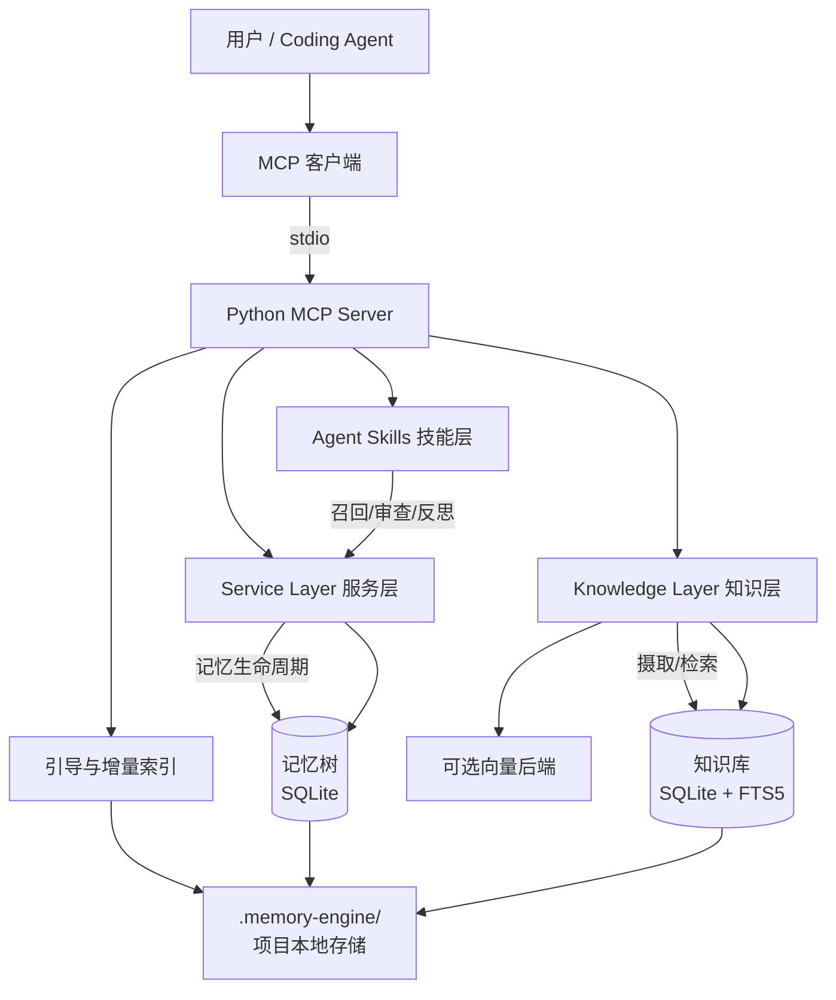
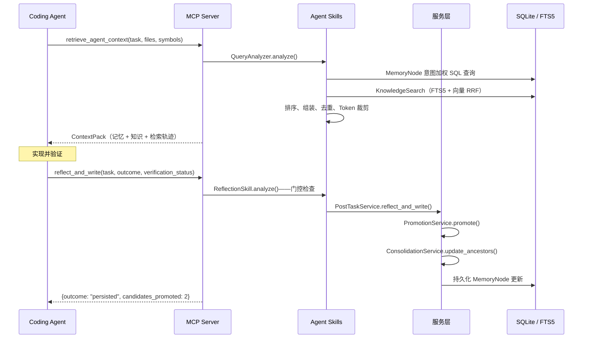

<p align="center">
  
</p>

<p align="center">
  <strong>为 Coding Agent 提供跨会话持久记忆与项目知识检索能力的本地优先 MCP 运行时。</strong>
</p>

<p align="center">
  <a href="https://github.com/uudam42/agent-memory-engine/actions/workflows/ci.yml">
    
  </a>
  <a href="https://github.com/uudam42/agent-memory-engine/blob/main/LICENSE">
    
  </a>
  
  
  
  
</p>

<p align="center">
  <a href="README.md">English</a> | <a href="README.zh-CN.md">中文</a>
</p>

---

# Agent Memory Engine

**一个本地优先的 MCP 运行时，为 Coding Agent 提供可追溯的项目长期记忆与基于代码、文档和测试证据的项目知识检索能力。**

---

## 为什么需要它

Coding Agent 面临一个根本性问题：每次会话都从零开始。

- Agent 无法在会话之间记住项目上下文
- 每次都要重新扫描代码库才能了解各模块的职责
- 过去排查过的 Bug、作出的技术决策、团队约定都会丢失
- 扁平的 RAG 无法区分稳定的业务约束、历史事故、架构决策和原始代码证据
- 即使上下文窗口再大，也需要智能的优先级排序和 Token 预算管理

Memory Engine 通过维护一棵结构化的、有证据支撑的记忆树，以及一个经过索引的项目知识库来解决这个问题。一切都在本地运行，一切都是自动的，无需任何基础设施。

---

## 核心能力

| 能力 | 说明 |
|---|---|
| **持久化记忆树** | MemoryNode 层次结构：业务约束、架构、模块职责、技术决策、故障事件、操作流程 |
| **有证据支撑的记忆** | 每个节点关联 Evidence 条目（测试输出、代码引用、Review 备注） |
| **候选暂存机制** | Reflection 生成 MemoryCandidate，经过 Promotion 流程进入正式记忆树 |
| **基于置信度的晋升** | create / update / merge / supersede / discard / needs_review |
| **冲突检测** | 高风险区域（认证、Schema、状态机、重试逻辑）自动标记 needs_review |
| **父节点摘要聚合** | 每次晋升后自动更新祖先节点摘要，无需手动维护 |
| **Agent 原生召回** | 编码任务前意图感知式检索，Agent 无需手动触发 |
| **渐进式记忆审查** | 可逐步展开任意记忆节点的子节点和关联证据 |
| **任务完成后自动反思** | Agent 汇报结果，系统决定是否留存知识及以何种形式留存 |
| **知识来源摄取** | Markdown、代码、ADR、测试报告、运行日志、Git Diff |
| **本地 FTS5 检索** | SQLite FTS5 + Porter 分词器，无需外部搜索引擎 |
| **可选向量检索** | InMemoryVectorIndex（临时）或未来的持久化向量后端 |
| **词法结构化降级模式** | 无向量后端时自动降级，全量检索依然可用 |
| **统一 ContextPack** | 记忆 + 知识合并、去重、Token 预算裁剪 |
| **检索可追溯** | 每次响应包含逐信号评分明细 |
| **本地优先隐私** | 所有数据保存在 `.memory-engine/`，不发送遥测，不调用云端 API |
| **Python MCP Server** | stdio 传输，无需 TypeScript、Docker 或外部守护进程 |
| **零配置自动初始化** | 首次 MCP 连接时自动完成引导流程 |
| **增量索引** | JSON 文件清单，后续启动只对变更文件重新索引 |

---

## 快速开始

### 前置条件：安装 `uv`（只需一次）

```bash
curl -LsSf https://astral.sh/uv/install.sh | sh
```

### 1. 克隆 Memory Engine

```bash
git clone https://github.com/your-org/memory-engine
```

### 2. 复制 MCP 配置块

**方式 A — 显式指定项目根目录：**

```json
{
  "mcpServers": {
    "memory-engine": {
      "command": "uv",
      "args": [
        "run",
        "--directory",
        "/memory-engine的绝对路径",
        "memory-engine-mcp",
        "--project-root",
        "/目标项目的绝对路径"
      ]
    }
  }
}
```

**方式 B — 通过环境变量指定项目根目录：**

```json
{
  "mcpServers": {
    "memory-engine": {
      "command": "uv",
      "args": [
        "run",
        "--directory",
        "/memory-engine的绝对路径",
        "memory-engine-mcp"
      ],
      "env": {
        "MEMORY_ENGINE_PROJECT_ROOT": "/目标项目的绝对路径"
      }
    }
  }
}
```

> **注意：** 请将所有路径替换为本机上的真实路径。
> 配置文件的位置和工作区变量支持因客户端不同而有所差异：
> - **Cursor：** `.cursor/mcp.json` 或全局 Cursor MCP 设置
> - **Claude Code：** `~/.claude.json` 或项目级配置文件
> - 具体位置请参阅对应客户端的 MCP 文档。

### 3. 打开目标项目，开始编码

完成。Memory Engine 在后台自动完成所有初始化工作。

---

## 自动化流程说明

```
用户打开项目
     │
     ▼
MCP 客户端通过 stdio 启动 memory-engine-mcp
     │
     ▼
解析项目根目录（.git / pyproject.toml / package.json 标记文件）
     │
     ▼
首次使用时自动创建 .memory-engine/
     │
     ▼
优先索引 README、ADR、架构文档、约束文件
     │
     ▼
在后台持续索引更广泛的源代码
     │
     ▼
Agent 开始非简单编码任务
     │
     ▼  [自动触发]
调用 retrieve_agent_context
     │   → 返回相关约束、故障事件、技术决策、操作流程、源码引用
     │
     ▼
Agent 实现并验证
     │
     ▼  [验证通过后自动触发]
调用 reflect_and_write
     │   → 系统评估是否值得留存
     │   → 生成 MemoryCandidate
     │   → 晋升入记忆树
     │   → 聚合祖先节点摘要
     │
     ▼
memory_status 显示更新后的计数
```

---

## 架构图



---

## 主要调用链



---

## 记忆生命周期

```
任务结果
    │
    ▼
ReflectionSkill.analyze()
    │  门控条件：outcome ≠ failed/reverted，verification_status，
    │            置信度 ≥ 阈值，摘要字数，已知的简单变更
    │
    ├─ 跳过 → 返回 {skip_reason}
    │
    └─ 通过 ▼
    │
生成 MemoryCandidate
    ├─ constraint（重要度 0.92）
    ├─ procedure （重要度 0.72）
    ├─ incident  （重要度 0.85）
    ├─ module    （重要度 0.62）
    └─ decision  （重要度 0.82）
    │
    ▼
PromotionService.promote()
    ├─ create     — 新节点
    ├─ update     — 相同标题，更新内容
    ├─ merge      — 近似重复（Jaccard ≥ 0.80）
    ├─ supersede  — 现有节点已确认错误或过时
    ├─ discard    — 价值低 / 已知晓 / 太模糊
    └─ needs_review — 与高置信度现有节点存在冲突
    │
    ▼
ConsolidationService.update_ancestors()
    │  parent.summary = 子节点摘要的拼接
    ▼
缓存失效 + memory_revision 自增
```

### 节点状态说明

| 状态 | 含义 |
|---|---|
| `candidate` | 已暂存，待晋升决策 |
| `active` | 活跃，参与召回 |
| `stale` | 已过时，保留历史记录 |
| `superseded` | 已被更新的节点替代 |
| `needs_review` | 检测到冲突，建议人工审查 |

---

## 知识摄取与检索

```
文档 / 代码 / ADR / 测试 / 日志 / Diff
    │
    ▼
redact()  ← 8 种模式：API Key、Token、密码、私钥、
           │           连接字符串、JWT、AWS Key、Slack Token
    ▼
SHA-256 内容哈希 → 去重检查
    │
    ▼
按来源类型分块
    ├─ Markdown    → 基于标题的章节（≤1200 tokens）
    ├─ 代码        → 类/函数块（≤1000 tokens）
    ├─ 测试报告    → 测试结果窗口
    ├─ 日志        → 滑动窗口（≤600 tokens）
    └─ Diff/Patch  → Hunk 分块
    │
    ▼
KnowledgeDocument + KnowledgeChunk（SQLite）
    │
    ├─ FTS5 插入（词法检索，始终可用）
    └─ 向量 Upsert（可选，InMemoryVectorIndex 或 Qdrant）
    │
    ▼
混合检索 → RRF 融合 → 来源质量排序 → UnifiedContextPack（占 40% Token 预算）
```

---

## 目录结构

```
memory_engine/
├── main.py                  ← FastAPI 应用（开发 / 直接 API 调用）
├── cli.py                   ← 调试 CLI
├── config.py                ← Pydantic Settings
│
├── agent/                   ← Stage 8 命名空间（重导出）
│   ├── skills/              → memory_engine.skills
│   ├── policies/            → 反思门控常量
│   └── contracts/           → Agent I/O 领域模型
│
├── skills/                  ← Agent 行为层（召回、审查、反思）
├── services/                ← 领域编排（晋升、聚合）
├── knowledge/               ← 摄取、分块、FTS5、向量、检索、缓存
├── repositories/            ← 持久化抽象层
├── models/                  ← Pydantic 领域模型 + SQLAlchemy ORM
│
├── bootstrap/               ← 本地运行时（根目录解析、存储、安全、状态）
├── runtime/                 ← Stage 8 命名空间（重导出 bootstrap + cache + config）
│
├── mcp/                     ← MCP 适配层（工具、资源、服务端、项目上下文）
├── api/                     ← FastAPI 路由
└── db/                      ← SQLite 会话 + 初始化

docs/
├── architecture/            ← 系统概览、记忆生命周期、知识流水线、检索流水线、
│                               MCP 集成、本地运行时
└── guides/                  ← 快速入门、配置、隐私与安全
```

---

## MCP 工具列表

| 工具 | 用途 |
|---|---|
| `retrieve_agent_context` | 编码任务前检索记忆和知识 |
| `inspect_memory` | 深入审查 MemoryNode 及其子节点和证据 |
| `inspect_knowledge` | 查看 KnowledgeChunk 或源文件范围（已脱敏） |
| `reflect_and_write` | 向反思流水线汇报验证通过的任务结果 |
| `memory_status` | 项目健康状态、检索模式、索引计数、版本号 |
| `refresh_project_knowledge` | 触发增量重扫（仅在明确需要时使用） |

## MCP 资源列表

| 资源 URI | 内容 |
|---|---|
| `memory://project/current/constraints` | 活跃的项目约束 |
| `memory://project/current/architecture` | 架构与模块摘要 |
| `memory://project/current/status` | 引导状态、检索模式、健康情况 |
| `memory://project/current/recent-incidents` | 近期故障事件 |
| `memory://project/current/memory-tree-summary` | 记忆树概览 |
| `memory://project/current/agent-policy` | 自动生成的 Agent 策略文件 |

---

## 本地存储结构

```
your-project/.memory-engine/
├── config.yaml              ← 可编辑；重新引导时不会覆盖
├── project_state.json       ← 引导状态、版本号
├── memory.db                ← 所有数据（记忆、知识、候选）
├── indexes/manifests/       ← 增量索引文件清单
├── generated/
│   └── AGENT_MEMORY_POLICY.md    ← 自动生成的 Agent 策略
├── bootstrap/bootstrap_report.json
├── constraints.md           ← 人工编写，可提交到 Git
├── team-rules.md            ← 人工编写，可提交到 Git
└── decisions.md             ← 人工编写，可提交到 Git
```

建议在 `.gitignore` 中加入 `.memory-engine/`（首次引导时自动生成提示块）。
三个人工编写的 `.md` 文件可按需提交到 Git 进行团队共享。

**重置方法：** `rm -rf your-project/.memory-engine/`

---

## 人工种子知识

通过以下文件为 Agent 提供无法从代码中安全推断的稳定项目知识：

**`.memory-engine/constraints.md`**
```markdown
# 项目约束

## 认证
不得绕过 JWT 验证，所有路由必须校验 Bearer Token。

## 数据库
禁止使用原始 SQL，只使用 SQLAlchemy ORM。

## 调度器
终态任务（COMPLETED、FAILED、CANCELLED）的状态不可变更。
```

**`.memory-engine/team-rules.md`**
```markdown
# 团队规范

- PR 需要至少 2 人 Review 后才能合并
- 所有公开 API 必须有 OpenAPI 文档
- 生产代码中只使用结构化 JSON 日志，禁止 print 语句
```

以上文件在引导时作为高优先级知识摄取，并在相关任务前优先返回给 Agent。

---

## 检索模式说明

### 默认本地模式：`lexical_structured_fallback`

当无可用持久化向量后端时启用（本地使用的默认模式）。

排序信号：
- SQLite FTS5 词法匹配（BM25）
- 模块路径与当前任务文件的重叠度
- 符号与当前任务符号的重叠度
- 记忆树中的节点距离
- 节点重要度与置信度
- 新鲜度（时效性权重）
- 项目级别 TTL 缓存

### 增强模式：`hybrid_lexical_vector`

当持久化向量后端健康时启用。通过 RRF 融合增加嵌入余弦相似度信号。

**向量检索是可选的。** 默认本地模式无需 Qdrant、Docker 或任何外部服务即可正常工作。

当向量检索不可用时，响应中会附带降级模式提示：

```json
{
  "meta": {
    "retrieval_mode": "lexical_structured_fallback",
    "vector_backend": "ephemeral",
    "warnings": ["向量语义检索不可用，结果使用词法、模块路径、符号及记忆树排序。"]
  }
}
```

---

## 隐私与安全边界

- **本地优先：** 所有数据保存在 `.memory-engine/`，不离开本机
- **无遥测：** 不向任何地方发送使用数据
- **无云端嵌入：** 默认不调用外部 API
- **无 Docker：** 任何功能都不需要 Docker
- **路径边界：** 所有文件读取限制在已解析的项目根目录内
- **符号链接保护：** 指向项目根目录外的符号链接会被拒绝
- **秘密脱敏：** 在持久化前和 MCP 输出前各运行一次
- **默认排除：** `.env`、`secrets/`、`*.pem`、`*.key`、`node_modules/`、`.git/`、二进制文件、超过 5 MB 的文件
- **不自动 Git 提交：** 永远不会
- **不修改 `.memory-engine/` 以外的文件：** 严格保证

---

## 项目配置

首次引导时在 `.memory-engine/config.yaml` 中自动生成：

```yaml
project:
  name: auto
  root_path: auto

runtime:
  auto_bootstrap: true
  auto_recall: true
  auto_reflect: true
  auto_index_on_start: true
  incremental_indexing: true

privacy:
  mode: local
  redact_secrets: true
  allow_network_embedding: false

knowledge:
  include:
    - README.md
    - docs/**
    - src/**
    - app/**
    - lib/**
    - tests/**
  exclude:
    - node_modules/**
    - .git/**
    - .venv/**
    - dist/**
    - build/**
    - .env
    - secrets/**
  max_file_size_mb: 5

retrieval:
  default_token_budget: 6000
  cache_enabled: true
  vector_backend: auto
  allow_degraded_fallback: true
```

重新引导时会保留用户的修改内容。

---

## 演示场景

**调度器项目。任务：** 在不破坏终态任务语义的前提下，为重试逻辑添加指数退避。

1. Agent 调用 `retrieve_agent_context`，返回：

```json
{
  "constraints": [
    {
      "title": "终态不可变性",
      "summary": "COMPLETED、FAILED、CANCELLED 是终态。任何从终态转出的操作都是严重 Bug。",
      "importance": 0.95
    }
  ],
  "incidents": [
    {
      "title": "重试循环重入终态任务",
      "summary": "v0.8.2 中，一个重试竞态条件导致 COMPLETED 任务被重新入队。根因：重试前未校验终态状态。",
      "importance": 0.88
    }
  ],
  "knowledge_chunks": [
    {
      "source_path": "docs/adr/003-retry-policy.md",
      "preview": "决策：使用带抖动的指数退避，最多重试 5 次..."
    }
  ],
  "meta": {
    "retrieval_mode": "lexical_structured_fallback",
    "vector_backend": "ephemeral",
    "warnings": ["向量检索不可用，使用词法结构化降级模式..."]
  }
}
```

2. Agent 在重试逻辑中添加终态守卫，实现指数退避。
3. 测试全部通过。Agent 调用 `reflect_and_write`：

```json
{
  "outcome": "persisted",
  "candidates_promoted": 2,
  "consolidation_notes": ["父节点「调度器核心」摘要已更新"]
}
```

---

## 调试 CLI

仅供维护者、演示和故障排查使用，不是常规工作流。

```bash
memory-engine debug status --project-root /path/to/project
memory-engine debug bootstrap --project-root /path/to/project
memory-engine debug index --project-root /path/to/project
memory-engine debug recall "添加重试退避" --project-root /path/to/project
memory-engine debug inspect <node-id>
memory-engine debug reset-project --project-root /path/to/project
```

---

## 测试

```bash
# 运行全部测试
pytest -v

# 运行特定测试
pytest tests/test_phase7.py -v
pytest -k "recall" -v
```

目前共 215 个测试，全部确定性通过，无需外部服务。

---

## 局限性与未来工作

- **持久化本地向量后端** — 当前 InMemoryVectorIndex 在进程重启后不保留数据
- **可选 Qdrant 后端** — 接口已定义，客户端默认未安装
- **PyPI 发布** — `pip install memory-engine-mcp` 暂不可用
- **二进制打包** — 暂无二进制安装包
- **IDE 插件** — 暂无 Cursor / VS Code 扩展
- **Streamable HTTP 远程模式** — 目前仅支持 stdio，暂不支持团队共享 HTTP 传输
- **团队共享记忆** — 每个项目拥有隔离的本地存储，暂不支持跨团队共享
- **认证与权限** — 暂无用户级或团队级访问控制
- **更丰富的代码解析** — 目前基于行范围分块，暂不支持 AST 感知解析
- **大型仓库基准测试** — 尚未在 Monorepo 规模下验证

---

## 贡献指南

1. 先阅读 [`docs/architecture/system-overview.md`](docs/architecture/system-overview.md)
2. 保持服务层边界：MCP / API 层保持轻薄
3. 业务逻辑放在 `skills/`、`services/`、`knowledge/` 中
4. 新的知识来源类型 → `knowledge/chunkers.py` + 新的 `SourceType` 枚举值
5. 新的 MCP 工具 → `mcp/tools.py`，仅作轻薄封装，委托给服务层
6. 新的领域模型 → `models/domain.py` 或 `models/knowledge_domain.py`
7. 为所有新行为添加测试
8. 不得削弱项目根目录安全边界
9. 提 PR 前运行 `pytest -v` 确认全部测试通过

---

## 开发者指南

```bash
# 安装开发依赖
pip install -e ".[dev]"

# 运行测试
pytest -v

# 启动 FastAPI 服务（开发 / 直接 API 调用）
uvicorn memory_engine.main:app --reload
# API 文档：http://localhost:8000/docs

# 直接运行 MCP 服务端（调试用）
uv run memory-engine-mcp --project-root /path/to/project --log-level DEBUG
```
